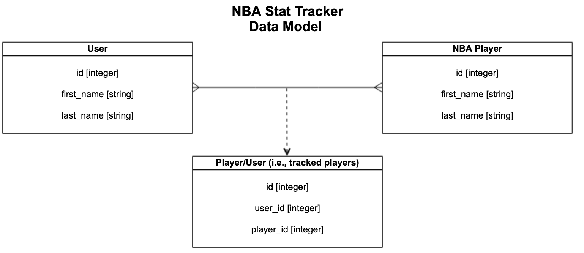
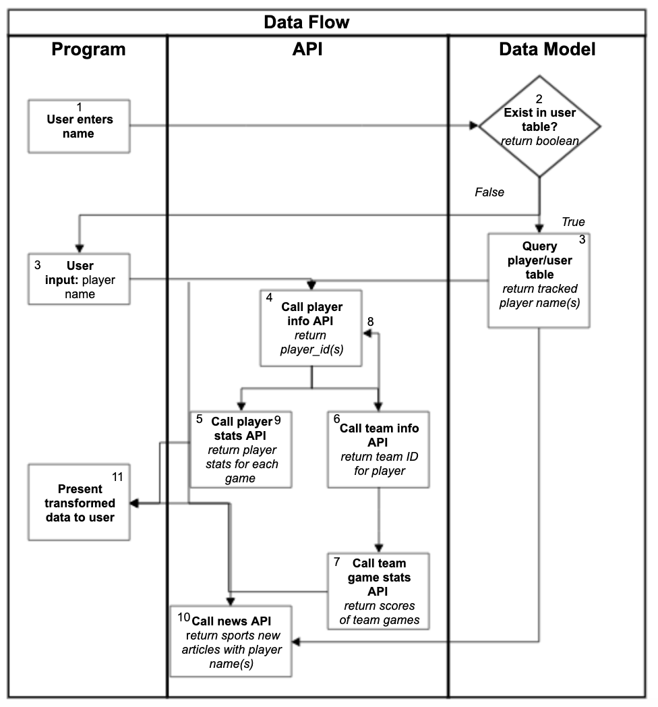

# NBA Stat Tracker

#### Njenga Kariuki and Matthew Shin
###### Project completed as part of Flatiron School Module 1 Curriculum

## FAQ
#### 1. What is NBA Stat Tracker?
A CLI program that enables users to stay up-to-date on their favorite NBA player’s stats (individual and team) and top news articles in one place. Stats and news articles refresh every 10 minutes.

#### 2. How does it work?
After installing the program (see instructions below), users create an account and pick the players they would like to track. Each time users return to their program, they receive a summary of stats and news articles for their tracked players. At any time, users can add or delete players from their tracked list.   

If users do not want to create an account, they can still search players and view stats and top articles.

#### 3. What is the customer problem we are solving?
Eliminating the need to juggle between stat and news sites/apps to stay updated on your favorite NBA players.

## Installation Instructions
#### OSX/Linux
```
1. Fork the repository: https://github.com/njenga-kariuki/module-one-final-project-guidelines-seattle-web-career-021819
2. Clone the repository into a file in your terminal
3. Run 'bundle install' to install required gems
4. Enter 'rake db:migrate' to create database
5. Enter 'ruby bin/cli.rb' to enter CLI
```
## Project Requirements
Build a CLI program with the following components:
1.	At least three data models (including one join model) using Active Record.
2.	Third-party API integration.
3.	Basic user authentication.
4.	User CRUD functionality.

#### Time allocated
2.5 days

## Diagrams
#### Active Record Data Models


#### Program Data Flow




API hosted by https://www.balldontlie.io/ and https://newsapi.org
